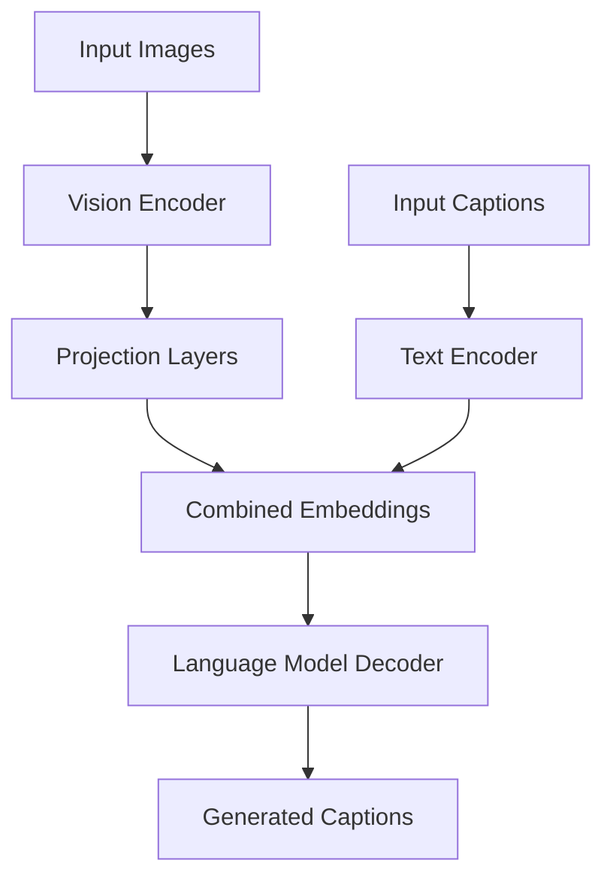

# VisionLanguageModel
A VisionLanguageModel implemented using frozen image/text encoders and a custom loss. Used for the image captioning task.

# Overview
Extracts visual features using pretrained vision models (via `timm`), processes text with transformer-based language models (via `transformers`), projects visual features into the text embedding space, and combines image and text embeddings for tasks like caption generation.

# Architecture
The following flowchart illustrates the model's architecture:



# Usage
## Installation
```bash
git clone https://github.com/your-repo/vision-language-model.git
cd vision-language-model
pip install torch torchvision timm einops transformers
```
## Training
```python
from train import train_vlm
train_vlm("../datasets/coco", "hf-hub:timm/mobilenetv4_conv_aa_large.e230_r448_in12k_ft_in1k", "HuggingFaceTB/SmolLM-135M")
```
## Inference
```python
image = Image.open(<img_path>).convert("RGB")
transform = transforms.Compose([
            transforms.Resize((224, 224)),
            transforms.ToTensor(),
            transforms.Normalize(mean=[0.485, 0.456, 0.406], std=[0.229, 0.224, 0.225])
        ])
images = transform(image).unsqueeze(0)
model.eval()
print (model.generate(images))
```
